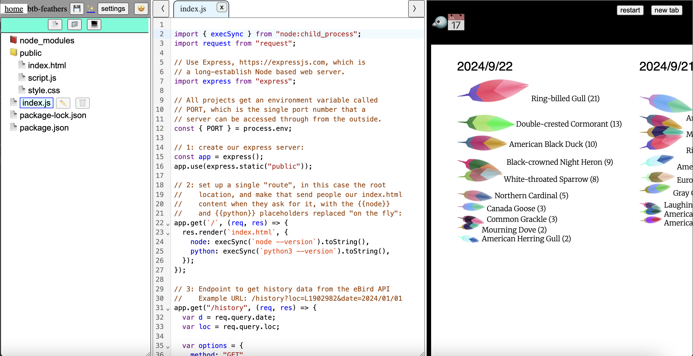
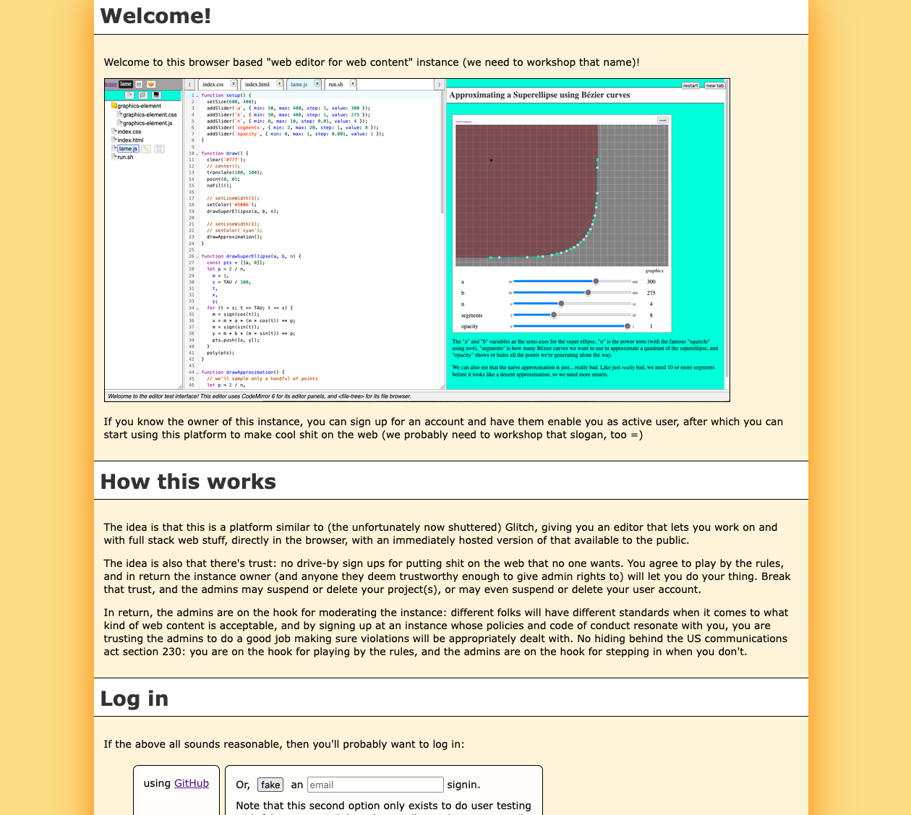
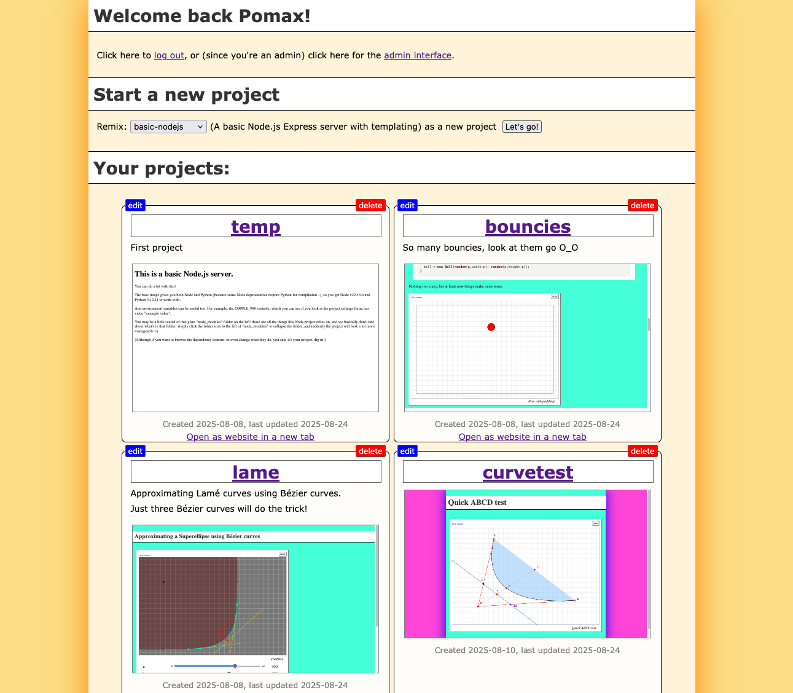
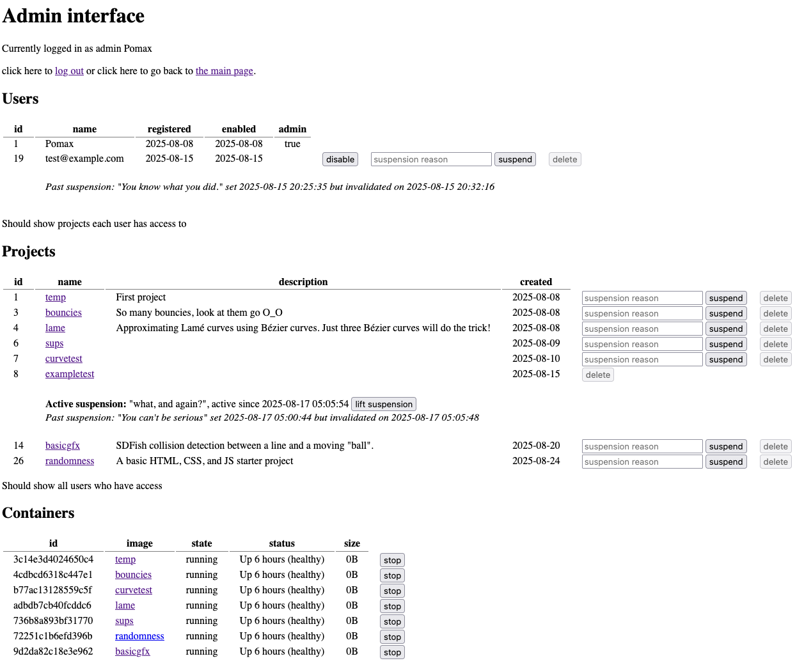

# Make Webbly Things!

Like over on https://make.webblythings.com! (just remember to read that wall of text, because unless we're friends, I'm unlikely to activate your account on my personal instance =)

See the [release notes](./RELEASE_NOTES.md) for the current release, and what changed with each release.

## Use the web to build the web

This is an attempt at implementing a friendly browser-based web content editing platform, using [codemirror 6](https://codemirror.net) as editor interface, [&lt;file-tree&gt;](https://github.com/pomax/custom-file-tree) as file tree component (as codemirror itself only models single editing panels), and a sprinkling of docker for runtime isolation and a reverse proxy because we like opening https URLs, and we don't like having to remember port numbers.

## What can we currently do?

See the ["what can we do?"](docs/what-can-we-do.md) document for all the details!

## Edit syncing

File operations are persisted to the file system by sending diffs, with content hashing to verify that what the client has loaded, and what's on-disk on the server, are the same.

This is currently one-way, using POST operations, rather than two-way using websockets. There's nothing preventing websockets from being used, but (a) make it work first, and (b) websocket security doesn't exist, so we'd have to write a bunch of code to make all of that work well. We can do that later. They're absolutely getting put in, because collaborative editing pretty much _requires_ websockets, but it's a post-v1 thing.

## Any screenshots?

Sure thing. Here's the main page if you're not logged in right now:

Or, if you are and you have a bunch of cool projects made already:

Or of course, what if you're an admin?? O_O

Okay that one needs work. You get the idea.

## This doesn't look... done?

To reiterate, the recipe for doing software development goes:

1. make it work,
2. make it work properly (aka "make it fast", "make it secure", etc.),
3. make it nice

We're still in phase 1. We're super close to phase 2! But we're still in phase 1.

## Does it have to look this way?

No of course not: it's just web pages, so you can change the templates and CSS to make it look _nothing_ like these screenshots. If you know even basic HTML and CSS, that's the "easiest" way to make this your own and give it your own look and feel!

## Alright, I'm sold, how do I install this on my own computer?

1. It's a **Node.js** project, so you'll need that installed. Specifically, you will need Node version 24 or newer.
1. You'll also need **Git** installed. Normally that goes without saying, but in this case we're also using it as an under-the-hood tool for performing version control for project content so you can't just copy this repo's source code, you _need_ `git` installed properly.
1. You'll also need **Docker** installed, for running projects in an isolated context.
1. And you'll want **Caddy** installed, for reverse-proxying localhost ports to normal host names.
1. For the database, you need **SQLite3** installed because that's what we're using for our databases.
1. And finally, you may need to run a special `playwright` command as part of first-time installtion.

### See the [how to install everything](./docs/installation.md) doc if you need help with installing any (or all) of these prerequisites.

With those prerequisites met:

- Clone this repo (or fork it and then clone that), then
- run `npm install` in the repo folder.
  - this may show a Playwright box instructing you to install some missing dependencies. If so: follow those instructions. Then,
- run `node setup` in the repo folder.

Once that finishes, things should be cross-platform enough to work on Windows, Mac, and Linux by running `npm start` and then opening the URL that tells you things are running on.

The main page has a login link that uses github authentication (for now). After authenticating, you're dropped into what is basically a "profile-ish" view (which I'm sure will change in the future, but we're still in the PoC phase) where you can create new projects, load up projects you've made, and delete projects you no longer care about.

Note that the first user to log in after the initial setup becomes the default admin user. Any admin user will have a link to the admin page available, which is a fairly bare bones but fully features, letting you enable/disable and (un)suspend users, or just delete their account (take that, spammers!), (un)suspend or delete projects, and perform container maintenance (which right now just means "hit the stop button" =D).

Also note that there are, technically, two login options _if the `LOCAL_DEV_TESTING` env var is set to `true`_ (which it will be, by default). This second option is a dev-only "magic link" email login form that doesn't actually email anyone and instead logs the activation link to the console's stdout... its only purpose is to let admins create test user accounts for messing around with. Always fun to suspend or delete test users!

## What if I want to deploy my own instance?

That's what it was created for, so if you want to run your own instance: awesome!

Give [the deployment doc](./docs/deploying.md) a read-through. There's a bit more information than in this README.md, but all of it will be important to have gone through if you want to set up your own instance.

## I want more and⧸or I have ideas!

I know. [Get in touch](https://github.com/Pomax/make-webbly-things/issues). We can do more.

There's some minor [dev documentation](./docs/development.md) but the best place to start is probably to file an issue or discussion thread about the thing you're thinking of (don't work on a PR in silence without first filing an issue or discussion thread: the odds that whatever you made won't even be compatible with the platform anymore during the early days of development)

- [Pomax](https://mastodon.social/deck/@TheRealPomax)
